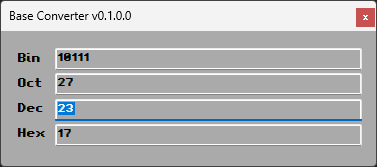

# Base Converter
---
This is just another base converter software, based on ***C*** code written for the ***AMIGA***.
Pretty straight forward ***WinForms*** application, with a simple GUI, that allows you to convert numbers from one base to another.

The `convert.cpp` is adjusted to use ***C++*** with `extern` keyword, so it can be used in ***C#*** directly.

## Screenshots


<br/>
*Original software on Workbench 40.42*


<br/>
*WinForms application*

## Usage

If you want to use the library, use the `BaseConvWrapper` along with the `BaseConv` **DLL**.

In C# as following

```csharp
BaseConvWrapper.BaseConverter bc = BaseConvWrapper.BaseConverter.FromDecimal(23);

long decimalValue = bc.Decimal; // 23
string octalValue = bc.Octal; // 27
string hexValue = bc.Hexadecimal; // 17
string binValue = bc.Binary; // 10111
```

---

The entire original application and sourcecode can be found [here](https://aminet.net/package/util/wb/BaseConv.lha).